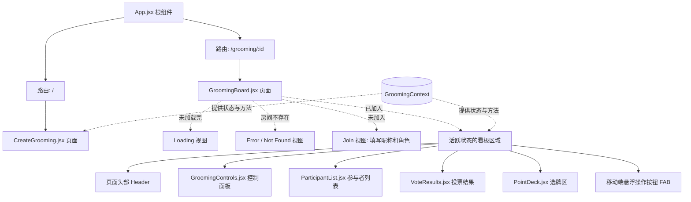

# UI 组件图谱 (UI Component Map)

这份图谱反映了当前代码库中页面和组件的层级结构。

## 核心职责简述

1. **`CreateGrooming`**: 负责创建一场新的 Grooming，并设置 `Point` 的范围。
2. **`GroomingBoard`**: 作为承载业务逻辑的巨型页面容器（Fat Page），内部通过状态切换了四个完全不同的视图（加载、错误、加入、主看板）。
3. **`GroomingControls`**: 管理全局行为，例如“开始新的一轮 Vote”。
4. **`ParticipantList`**: 显示当前的参与者，以及他们在本轮 `Vote` 中的状态。
5. **`VoteResults`**: 仅在 `Revealed` 状态下展示，负责统计大家的出牌结果和共识度。
6. **`PointDeck`**: 显示 `Deck` 的所有牌面，供参与者在 `Voting` 阶段出牌。
