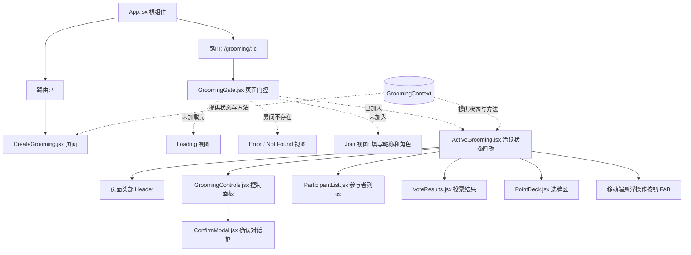

# UI 组件图谱 (UI Component Map)

这份图谱反映了当前代码库中页面和组件的层级结构。

## 核心职责简述

1. **`CreateGrooming`**: 负责创建一场新的 Grooming，并设置 `Point` 的范围。
2. **`GroomingGate`**: 作为路由入口的门控屏障（Gate），拦截并处理四个不同的前置状态（加载、错误、加入表单），只有验证通过后才渲染核心的 `ActiveGrooming`。
3. **`ActiveGrooming`**: 专门负责渲染活跃状态下的看板区域，直接消费上下文数据而无需进行身份验证防御。
3. **`GroomingControls`**: 管理全局行为，例如"开始新的一轮 Vote"或在 Voting 阶段"Restart Vote"（带确认对话框）。
4. **`ParticipantList`**: 显示当前的参与者，以及他们在本轮 `Vote` 中的状态。
5. **`VoteResults`**: 仅在 `Revealed` 状态下展示，负责统计大家的出牌结果和共识度。
6. **`PointDeck`**: 显示 `Deck` 的所有牌面，供参与者在 `Voting` 阶段出牌。
